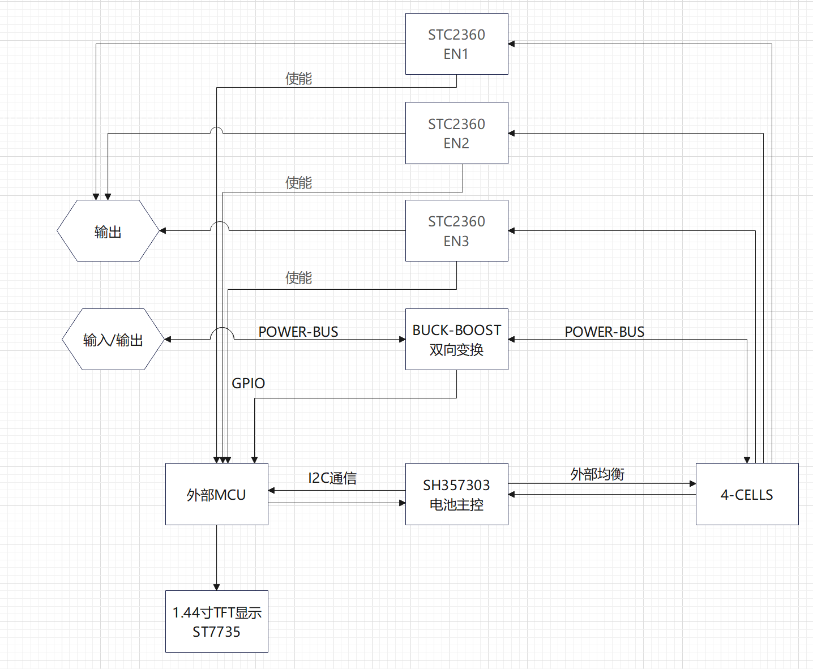
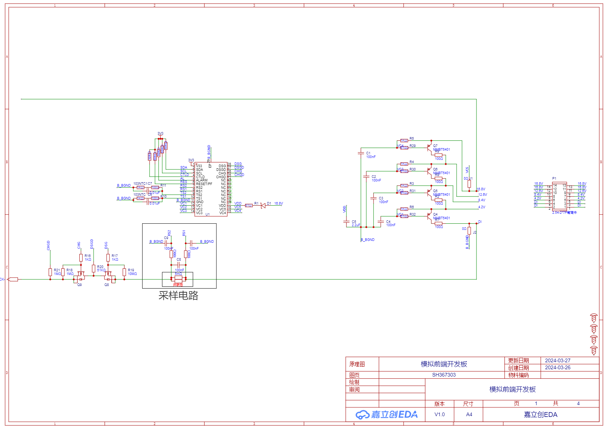
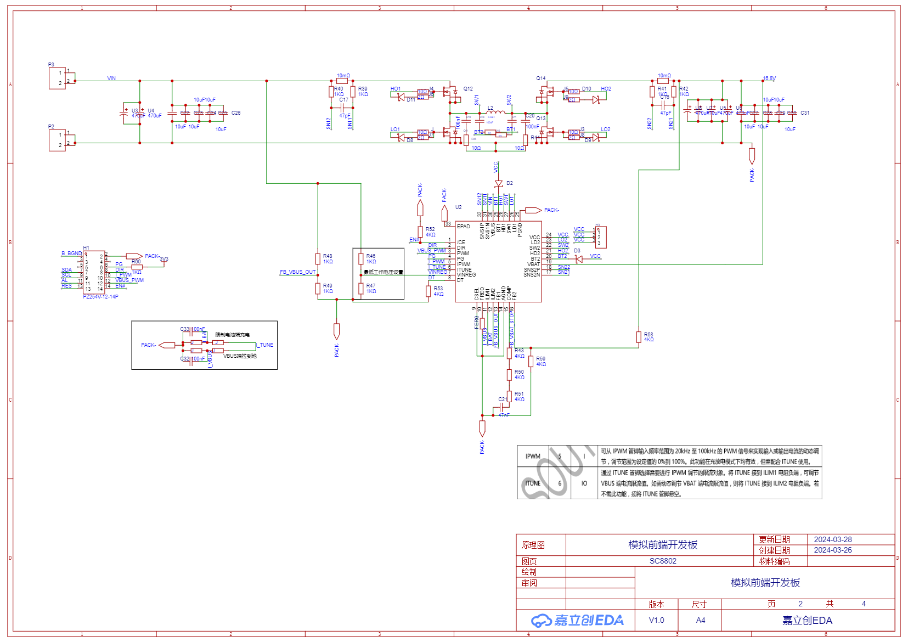
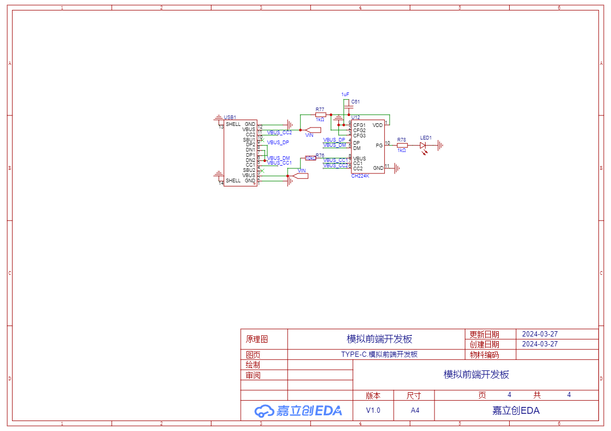
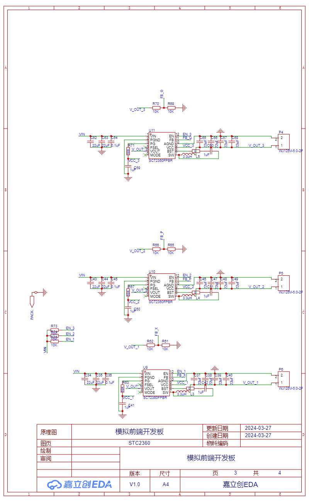
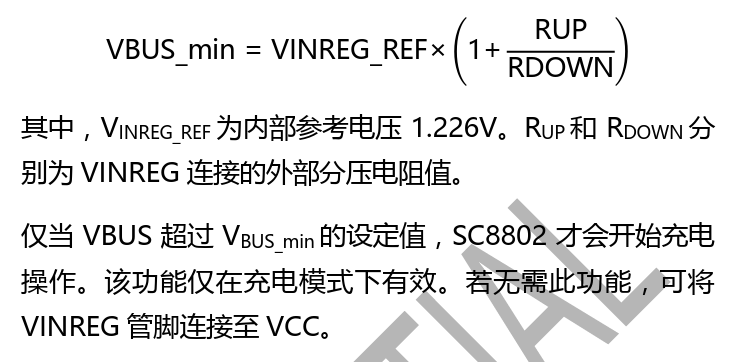
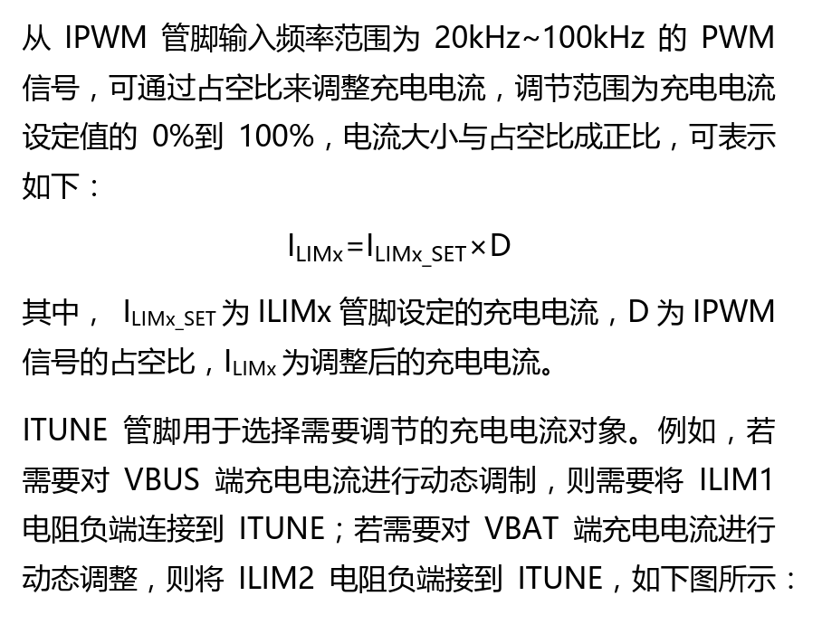
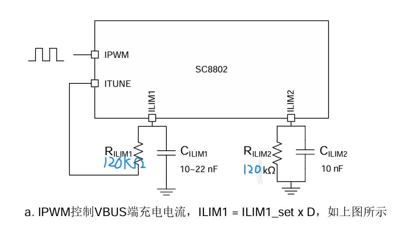
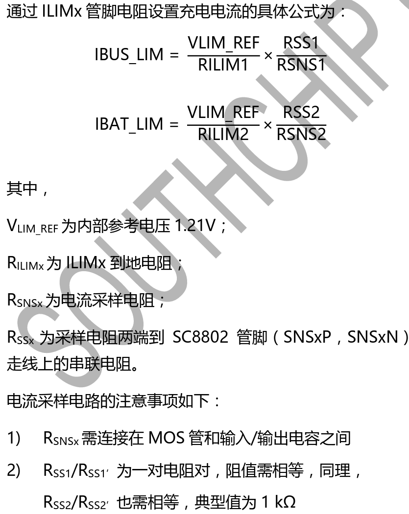

# 一，基于SC8802与SH367303的4-CELLS模拟前端开发板

## （一）制作思路

### 1.使用SC8802作为BUCK-BOOST双向变换器为电池组降压充电或者升压放电，维持电源的一致性。
### 2.使用SH367303作为电池组主控，外部均衡。
### 3.使用外部mcu进行图像处理
### 4.使用显示屏实时显示电池组状态
> #### 补充：使用**STC2360** 输出几种不同电压
## （二）主拓扑

## （三）制作目的
主要是练习单片机寄存器的读取，熟悉TWO协议，练习I2C的使用，本人主要使用micro python进行编程，主要是练习这个主流语言的，<b>我其实是一个弱鸡。</b>做着玩玩反正本人现在手上也有许多电池，想着玩玩模拟前端
## （四）电路图一览
### 保护电路

### BUCK-BOOST升降压变换

### TYPE-C诱骗

### STC2360降压电路

### 板子还是得改动，暂时不能直接打板来做

# 二，原理详解/计算

## 其他引脚的设置
### 最低工作电压，通过VREF脚设置最低充电电压，最低8V吧，再低的话效率就上不去了
- 分压电阻的设置，设置为上电阻56kΩ，下电阻10kΩ，计算之后最低工作电压大概是8.09v，符合预期
- 
## 1.充电过程（不需要BAT端的限流作用）
### （1）~~我服了直接好难啊~~，言归正传让我们开始吧！
### （2）首先，**DIR**引脚拉低,ILIM2连接到**ITUNE**
### （3）充电限流调节 **（6A为例）**
- （1，需要充电限流功能，直接选用芯片手册中的，限流电阻10mΩ，RSS = 1kΩ
- > 原话：RSNSx表示功率路径上的电流采样电阻（x代表1或2），当
电流流经时，电阻两端产生电压差。RSSx和 RSSx’将产生的
差分电压反馈回SC8802以此获取电流信息。CSSx滤波电容
用于滤除差分噪声，典型值为47pF。
- （2，**ILIM2**引脚通过一个电阻接到地，RILIM2 = 120kΩ
- （3，**ITUNE**连接到**RLIM1**，RILIM1 = 120kΩ
- （4，另提一嘴，RSS引脚与RILIM不是一个电阻，容易混淆
- （5，最后引出IPWM引脚到单片机
- 
- 
- 
## 2,放电过程（不做BAT端的限流）
### 
